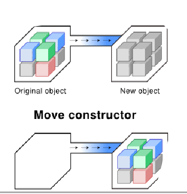

# Value and/or reference semantics

## Value semantics
Value sematics means the assignment copies the value, not just the pointer.
The benefits include: 
- Default in C++: when you assign one object to another or pass an object to a function, a copy of the object is made.
This means that when you assign one object to another or pass an object to a function, the copy is made. The changes to one object 
do not affect the copied object.

- Avoid memory management issue such as the dangling referrences, free store allocation, memory leaks:
When objects are copied, each object manages its own memory. This reduces the risk of memory mismanagement issues
as forgetting to delete dynamically.

Free allocation is managed in stack is always faster than heap (dynamic deallocation).

- Avoid reference aliasing:
Reference aliasing occurs when mutiple references or pointers point to the same memory location, leading
to unexpected side effects when one reference modifies the data. Therefore, value semantics ensure that each object
is an independant copy, eliminating the pontential for an aliasing issues.

- Referential transparency:
Referential transparency is a property where the value of an expression depends only on its inputs and not on any external state. Value semantics contribute to referential transparency by ensuring that functions operate on copies of objects rather than references to mutable state. This makes functions easier to understand, test, and reason about because their behavior is predictable and does not depend on external changes.

## Reference semantics
Reference semantics are used in C++ for several key reasons, particularly in the context of object-oriented programming and performance optimization:

- Object-Oriented Technique:

Reference semantics are fundamental in object-oriented programming, enabling the use of references and pointers to objects. This allows for the implementation of complex data structures like linked lists, trees, and graphs, where objects refer to one another.

- Runtime Polymorphism:

Polymorphism, a core principle of object-oriented design, relies on reference semantics. By using pointers or references to base class objects, C++ can achieve runtime polymorphism through virtual functions, allowing derived class methods to be called dynamically.

- Performance:

Reference semantics can improve performance by avoiding the overhead of copying large objects. Instead of copying an object, a reference or pointer can be passed, which is more efficient, especially for large data structures or when frequent object manipulation is needed.

## Link to test
https://godbolt.org/

# Copy elision
Compiler can omit the copy construction of class objects under certain circumstances :

Exemple :
https://godbolt.org/z/Wo4sx5cs5

# Move semantic

Move semantics in C++ are a crucial feature introduced to enhance performance and resource management, especially in contexts where copying objects is expensive. Here's a clear explanation of move semantics and the key points you mentioned:

Move Semantics:

Move constructors and move assignment operators enable the transfer of resources from one object to another without copying. This is particularly useful for objects that manage resources like dynamic memory, file handles, or other system resources.

 

Move constructors and move assignment operators enable the transfer of resources from one object to another without copying. This is particularly useful for objects that manage resources like dynamic memory, file handles, or other system resources.

std::move is a standard library function that performs a cast to an rvalue, enabling move semantics. It does not actually move anything but rather allows the move constructor or move assignment operator to be invoked.

Exemple :
https://godbolt.org/z/Eo6W1casP

Move constructor: https://godbolt.org/z/nTG74fdn6

# Alternative to runtime polymorphism

Inheritance: https://godbolt.org/z/rxcdGbG7W

## Inheritance vs Template	
Pros
- Non intrusive
- No runtime overhead

Cons
- Compile time overhead and possible code bloat
- Need complete knowledge at compile time
- Cannot be stored in homogenous containers
- “Contagious”

Template   : https://godbolt.org/z/ovTGcWoM3

## Inheritance vs variant:
Pros
- Non intrusive
- Value semantic
- Multiple dispatch

Cons
- Separate operations from the class *
- Closed (need to know all the types upfront)
- Not suitable for deep hierarchy

Variant: https://godbolt.org/z/hxz9j3E5q

## Inheritance with type erasure
Pros
- Allow polymorphic behavior for unrelated types
- Extensible via free function
Cons
- Requires a bit of boiler plate, which can be difficult to understand at first sight
- Force heap allocation + indirection

type erasure: https://godbolt.org/z/P74Ed4nxo

