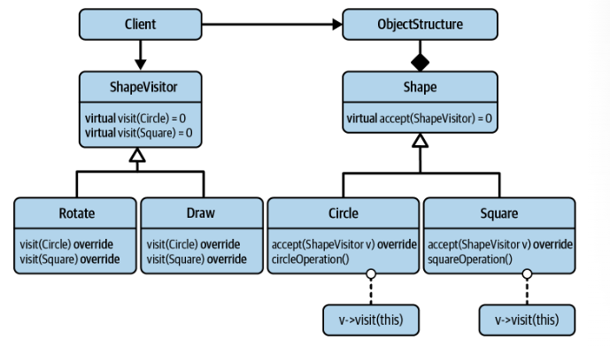
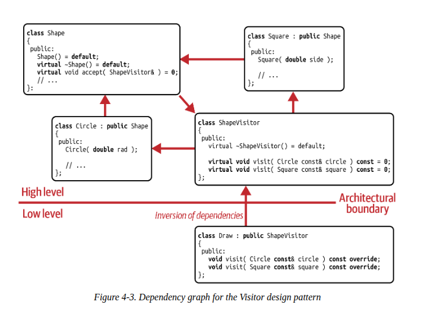

# Analyzing the design issues

Let's assume you are certain that we have already all the shapes.

Functional/ main requirements:
- That is, you consider the set of the shapes as `close set` 
- We are missing some operations, and we would like to add for examples:
    - Convert the instance of a shape into bytes.
    - Draw shapes.
    ...
    Therefore, we expect an open set of operations `open set`

Issues:

- Every new operations now requires you to insert a new virtual function into base class or pure virtual function.

=> Cause the extra work for anyone who created a shape by inheriting from the Shape base class.
=> Derived class must again implement the missing behavior and it would be a pure virtual function in disguise, or violation of LSP principles.

- The underlying reason is that adding virtual function violates the OCP principles.

If you really need to add new operations frequently, you should design so that the extension of operations is easy.

# Visitor Design pattern 
Represent an operations to be performed on the elements of an object structure. Visitor let's you define a new operation without changing the class of elements which operates.

- Shape visitor base class comes with one pure virtual `visit()` function for each concrete shape in Shape hierachy.
    - Enable Rotate class and implement all visit() functions.
    - Enable Draw class and implement all visit() functions.
    ...

- Design fullfill the OCP with respect to adding new operations.
- Making separate class, you follow the SRP, shape does not have to change for every new operation. This avoid frequent modifications of the Shape hierachy and enables the easy addition of new operations.
- Implement accept function can be used where you need to perform an operation.

Disadvantage:
- Is a low implementation flexibility. It exists method that can be very similar like Translate operation.
- It's becomme difficult to add new types  ==> cost of maintenance.

`Important notes`:
Visitor pattern requires a close set of types and in exchange provides an open set of operations.

